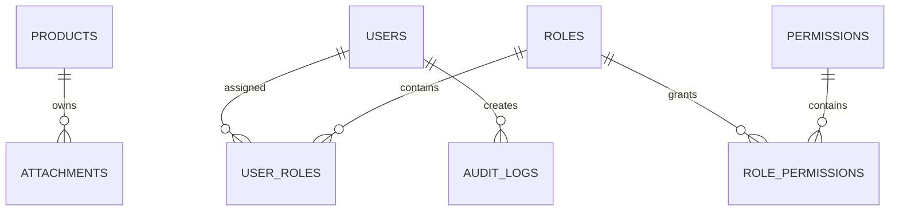
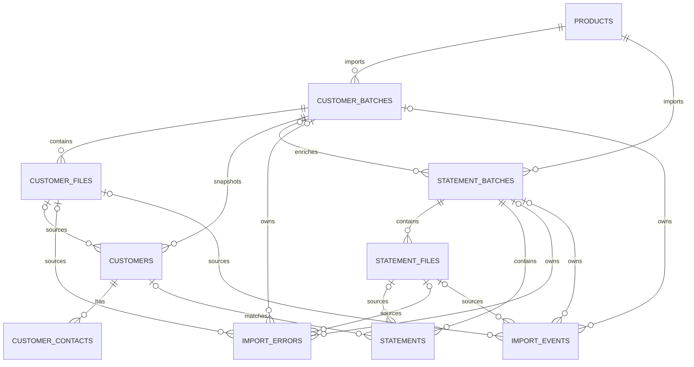
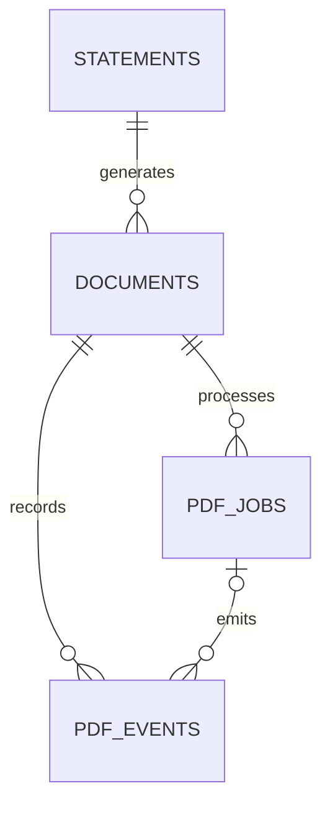
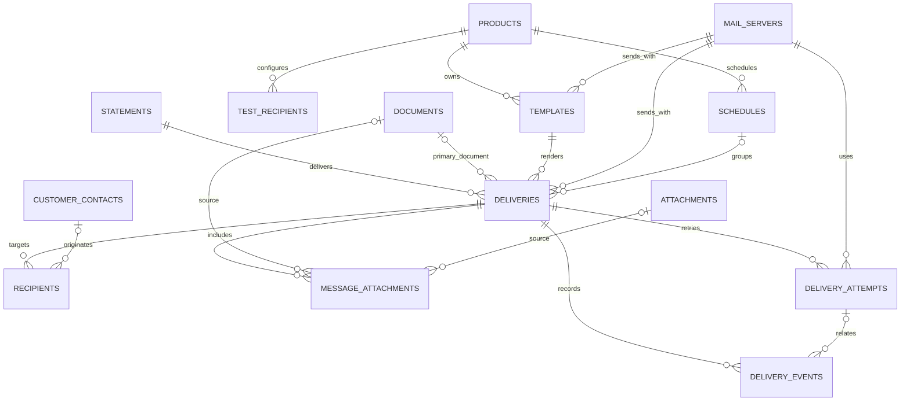

# Database V2 Canonical ERD

This document is the canonical relationship view for Database V2 after successful Laravel `migrate:fresh` validation.

## Core and authorization



## Import



## PDF



A statement has zero or many PDF document versions. `(statement_id, version)` uniquely identifies a version.

## Messaging



## End-to-end cardinality

```text
Product
  |
  +-- Customer Batch --< Customer File
  |        |
  |        +--< Customer --< Contact
  |
  +-- Statement Batch --< Statement File
           |
           +--< Statement
                  |
                  +--< PDF Document (versioned)
                  |       +--< PDF Job
                  |       +--< PDF Event
                  |
                  +--< Delivery
                         +--< Recipient
                         +--< Attachment
                         +--< Attempt
                         +--< Event
```

## Relationship rules

- Imported customers are period snapshots, not a mutable global customer master.
- Statements retain statement-time fields even when linked to an imported customer snapshot.
- A statement can produce multiple PDF versions.
- A statement can produce multiple logical deliveries (production, resend through a new execution, sample, or test).
- A delivery can have multiple SMTP/provider attempts.
- Provider feedback such as delivered/opened/bounced is an event, not a replacement for send history.
- Delivery recipients and attachments preserve execution-time snapshots.
- Historical parent relationships use restrictive deletion by default; true dependent children may cascade.
